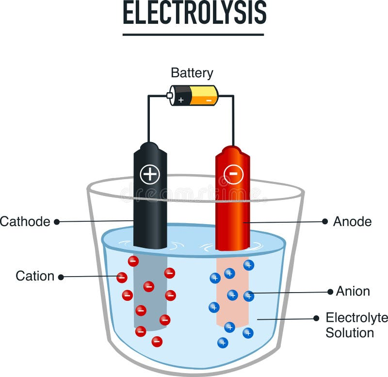

# Bases  
  ## Basicos de la pureza del agua
    Siendo el agua el componente esencial en los seres basados en carbono no es extraño que uno de los principales enfoques modernos sea la de su preservación, pues la constante amenaza de la escasez de este recurso en un futuro cercano supone nuevos desafíos para la vida en nuestro planeta, aun cuando el agua es legalmente un derecho fundametal en la mayor parte del planeta, existen aun millones de personas que no cuentan con el acceso a agua potable para consumo, el agua es una parte fundamental de la salud publica y enter los basicos de la pureza del agua es fundamental para asegurar el bienestar de poblaciones y comunidades.

    El agua puede ser contaminada por una gran cantidad de compuestos quimicos, virus, bacterias, metales pesados,etc. Los cuales pueden provenir de varias fuentes como lo son desechos agricolas, industriales y humanos, si no se trata adecuadamente el agua puede provocar una gran cantidad de padecimientos grastroinstinales como lo son la colera y la fiebre tifoidea, hepaticos como intoxicacion por metales pesados, trastornos neurologicos como lo son los provocados por algunos parasitos que se alojan en la materia gris.

    De acuerdo a la UNICEF, la disenteria es la segunda causa de muerte mas comun en el rango de infantes menores a 5 años, las mujeres embarazadas son particularmente vulnerables si se exponen a contaminantes como el mercurio, el plomo y el cadmio, que pueden afectar al desarrollo del feto, la poblacion geriartrica tambien se encuentra en riesgo pues en caso de desarrollar afecciones grastrointestinales son mas propensas a desarrollar afecciones de salud cronicas.

    Entre los contaminantes patologicos que representan una amenza mayor se pueden señalar la E. Coli, la Salmonela y el Proteus, en sus distintas mutaciones, los contaminantes quimicos de mayor relevancia son aquellos con capacidad de intoxicar a los humanos como lo son el cloro y derivados, azufre, arsenico,  acidos, entre otros desechos como lo son los de los vehiculos alimentados por energia fosil, uno de los que se omiten en la mayoria de casos son los metales pesados como lo son el plomo, el cadmio y el mercurio, que provocan intoxicaciones de mayor gravedad en los humanos.

    Con esto en mente, se plantea la pregunta, que se plantea claro es, que se puede hacer para garantizar la pureza del agua? los metodos de tratamiento de agua modernos mas comunes son:

    Filtracion: El agua atravieza una barrera fisica, como un filtro o varios, para remover residuos solidos 
    Desinfeccion: Mediante el uso de quimicos o luz UV, que elimina la actividad de patogenos en el agua
    Destilado: El agua se hierve para eliminar la actividad de patogenos y el vapor de agua condensado se recolecta como agua limpia 

    Mas ademas de estos procesos que se realizan previo a que el agua llegue al consumidor es importante tener en cuenta varias medidas de salubridad basica para garantizar que el agua ingerida permanezca pura, como lo son:

    Usar un filtro adicional en casa como uno de torre o en montado en la boquilla de la fuente 
    Evitar beber agua de fuentes con salubridad poco confiable 
    Lavarse las manos regularmente, antes de ingerir alientos o agua 
    Apoyar los esfuerzos locales para protejer y conservar las fuentes de agua salubres 

    Mas sin embargo, esss importante recalcar que los esfuerzos individuales no bastan para mantener la salubridad del agua en su ciclo de vida, pues es un problema que es mas optimo atender de raiz, alguna medidad que se plantean en la actualidad para mantener la salubridad del agua a nivel global son:

    Monitoreo: Realizar analisis periodicos en las fuentes de agua puede ayudar a identificar contaminantes potenciales y garantizar la fiabilidad de los metodos de purificacion empleados, estos puede realizarse ya sea tomando muestras y realizando analisis en laboratorio o en su defecto con pruebas en la fuente del agua

    Polizas de salubridad: Implementar polizas y practicas para reducir el descho derivado de actividades agricolas y de poblaciones humanas, como por ejemplo implementando practicas agricolas sotenibles reducir el uso de quimicos en la industria agricola y mejorar la infraestructura de tratamiento de agua para reducir contaminantes en fuentes de agua. 

    Concientizacion: Como se ha mencionado, es de vital importancia educar y concientizar a los individuos de diversas poblaciones sobre la importacia de la pureza del agua, creando asi una cultura de salubridad del agua que creara una reaccion en cadena para su conservacion a futuro.

    En años recientes, a existido una alza en el interes por el desarrollo de tecnologias que puedan mejorar la salubridad general del agua, como la implementacion de inteligecia artificial y machine learning para monitoreo de niveles de sanidad del agua para detectar contaminates en tiempo real asi como el desarrollo de nuevos materiales para purificadores 

    Con esto en mente se puede determinar lo importante que es la salubridad del agua en la acutalidad y nos posicionamos un paso mas cerca de lograr la sustentabilidad a largo plazo de este recurso

  ## Estigmas de investigacion
    El proyecto del sistema de electrodepuracion trifasica comenzo como una asignatura en la materia de ciencias experimentales la cual se imparte en cuarto semestre de preparatoria como parte del plan de estudios de la unidad academica de preparatoria de la universidad autonoma de zacatecas, el proposito de la asignatura era desarrollar la comprension de la metodologia de la investigacion en el alumno al implementar un proyecto de innovacion estructurado dentro de un protocolo de investigacion convencional, el cual involucraba plantear baes, una hipotesis, preguntas generales, un crognograma de las pruebas en la investigacion y una conlcusion sobre la fiabilidad del proyecto en su campo ded inovacion, desde el principio la investigacion de un componente tan importante como es la pureza del agua planetaba retos importantes por la gran cantidad de normas de salubridad que se requieren seguir en la procuracion del vital liquido, es por eso que en la acutalidad no existe una diversidad tan considerable en cuanto al desarrollo de metodos para la sanitizacion del agua, pues la gran mayoria de ello no llegan a cumplir con los requirmentos de suavidad del agua (medido en partes por millon) patogenos y de compuestos no deaseados que se forman durante la reaccion, por esto y como se menciono en el apartado de decalificaciones pseudocientificas se procuro evitar metodos de investigacion que pudiesen arrojar datos con poca relevancia real, en la materia de ciencias experimentales se detallaron distintos parametros a condiserar en la recopilacion de datos dentro de una investigacion, uno de los mas escenciales era la de que para que un estudio tuviese validez minima tendria que corroborarse la hipotesis al menos en tres de cuatro ocasiones con valores similares, ademas de emplear algoritmos de estadistica para obtener porcentajes asi como la de prescindir de valores aberrantes que pudieran, como es habitual, alterar la consistencia de la investigacion. Durante las multiples evaluaiones que atravezo el proyecto hasta este momento en todas ellas se cuestiono la credibilidad de los resultados aun despues del pitch, algo que a grandes rasgos resulta preocupante pues levanta sospechas sobre la metodologia de la investigacion con la que se desarrollo la toma de datos en el proyecto, como se menciona en el apartado de trayetoria, la recabacion de datos sufrio de varios contratiempos pues al haber sido redactado en fisico y graficado con herramientas de diseno grafico que no eran las adecuadas al final en los carteles y tripticos en los que se detallaban los datos recabados durante la investigacion , siendo que como se detalla en el apartado de experimentacion incial los primeros datos se hubieran recabado usando sistemas de medicion de partes por millon y ph bastante sencilloss, que sin embargo fueron lo suficientemente satisfactorios para establecer las bases del sistema de electrodepuracion trifasica con las que se prosigio a la realizacion de pruebas mas extensas en la planta purificadora de agua de la Unidad Acemica de Imgenieria Quimica de la UAZ , en donde utilizando sistemas de control de sanidad mas industriales se logro corroborar el campo de oportunidad para el desarrollo de este sistema de purifiacion en el futuro, siendo su principal punto a mejorar hasta el momento el de la seleccion de materiales para los diodos y lograr la regulacion de metales en el agua mediante el control del voltaje y sedimentacion de solidos en el agua. Sin embago en la actualidad todas los estudios que tomen de referencia aquellas referencias que no esten catalogadas como ciencias exactas seran inevitablemente catalogas como pseudociencias, aun cuando estas se redacten mediante la metodologia de la investigacion como lo es un protocolo de investigacion, aparatos de medicion calibrados, o cualquier cosa que se pueda englobar como cientifico, por eso en este proyecto, como en muchos otros desde el principio de la investigacion, ha decidido deslindarse de la necesidad de poder encajar estrictamente en la categoria de "cientifico", pues como se meciona en el apartado de decalificaciones a pseudociencia y base tecnica para poder asi hacerlo tendria que sacrificarse la posibilidad de que el proceso fuera completamente sustentable y economicamente fiable, aun cuando en la actualidad se han realizado grandes avances en materia de energias sustentables, su integracion con otros metodos de purificacion modernos resulta en general menos eficiente que el sistema de electrodepuracion trifasica, en el apartado de integracion con tecnologias emergentes se especifica lo dificil que resulta este mismo aspecto ya que el estudio de las que son afines a este proceso de purificacion tambien son de aspecto pseudocientifico, pero en el desarrollo actual del proyecto se procura mantener en medida de lo posible con las bases de la metodlogia de la investigacion y no se descarta ninguna posibilidad de implementacion de algun proceso mas "cientifico" en el proyecto, pues todas laa verdades pueden reconciliarse.

  ## Decalificaciones a pseudociencia
    Cuando comenzó el desarrollo de este proyecto, se tuvo muy en cuenta lo poco ortodoxo que resultaba el uso de estos procesos, ya que en el pasado se habían redactado artículos que descalificaban el uso de la electrólisis en el proceso de producción de hidrógeno, afirmando que era inviable para la desinfección del agua. Dado que el propósito principal del proyecto era emplear la electrólisis para suavizar el agua y pulir metales, con la desinfección como un proceso adicional realizado por la plata coloidal, presentaba una objeción significativa, incluso cuando solo estaba planeada en papel. Incluso en esta etapa intermedia del proyecto y, en caso de lograr su implementación a gran escala, es probable que esto persista por una razón u otra. Sin embargo, hay una cantidad suficiente de documentación que respalda la seguridad, eficiencia y fiabilidad general de estos procesos.

    En cuanto al uso de la electrólisis para suavizar el agua: este proceso, que es el primer paso de la electrodepuración trifásica, también es el más complejo y tiene espacio para el desarrollo adicional. Aunque la electrólisis se ha empleado para la purificación del agua con el fin de producir hidrógeno para la eliminación de patógenos en el agua, se ha descartado en el pasado por no ser viable económica ni energéticamente. Por esta razón, se reconsideró su uso para la suavización del agua, un paso faltante en los prototipos iniciales del purificador. Dado que uno de los aspectos clave del purificador es la posibilidad de intercambiar ánodos para manejar diferentes tipos de metales, existe el riesgo de que la reacción de estos genere subproductos no deseados en el purificador, siendo que parte de la docuemntacion que desacreditaba el uso de la electrolisis para la purificacion del agua es en la que se han realizado pruebas con diodos de cobre, que por la prescencia de otros reactivos en el agua teminaba por producir derivados del cloro, sin embargo, y tal como se detalla en el apartado de seleccion de materiales, se realizo una investigacion previa para descartar materiales que serian poco viables para los diodos, siendo este un apartado que permanece en desarrollo en el proyecto

    En el caso de la plata coliodal para la desinfeccion del agua los prejuicios llevarian una documentacion mucho mas extensa, pues siendo la plata colidal usada principalmente como antibiotico de reserva, se ha llevado muchas acusaciones por los efectos adversos que se han presentado en personas que ya sea por predisposicion medica o por mala administracion del compuesto, generalmente se han llegado a intoxicar con el mismo, siendo un ejemplo comun personas que desarrollan una coloracion azul en la piel tras una alta dosis prolongada o en su defecto una baja en la presion arterial de igual manera por una alta dosis del compuesto, sin embargo y tal y como se especifica en una de las principales paginas de divulgacion sobre la plata colidal,[Silver safety council](https://www.silversafety.com/), la plata coloidal no es danina para los humanos si se dosifica correctamente, ademas, el uso de la plata colidal para la desinfeccion de aliementos esta mas comercialmente generalizada, por lo que este proceso no represento un impedimento tan grande en cuanto a su aceptacion en el sistema de purificacion pues tan solo es cuestion de ajustar la concentracion del compuesto en la segunda fase del sistema de purificacion 
    
    El tercer proceso integrado al sistema de purificacion es el de electropulido, en cuento al que no exsite refutacion considerable pues del sistema es el proceso mas facil de replicar y su efectividad se comprueba facilmente, sin embargo por la naturaleza de la reaccion se puede llegar a considerar que al introducirse en la solucion salina el diodo posteriromente podria liberar reactivos no deseados en el agua alterando su ph y pureza, sin embargo en las prubas realizadas durante esta investigacion se determino que no existia pues una diferencia real entre el uso de un diodo procesado por electropulido y otro que no lo hubiese sido.

    En el campo de la investigacion en general y tomando de referencia inumerables referentes historicos se puede concluir facilmente que para que una declaracion se declare como coherente se necesitan argumentos, para que se declare como ciencia, se necesitara mucho mas, como se menciona en el apartado estigmas de la investigacion, en el desarrollo del proyecto se procuro la fiabilidad real del empleo de este sistema sobre el poder probar un punto que no tuviera base solida, como se suele dar en las tantas investigaciones cientificas que por el empleo de tecnicnas de investigacion poco comprobables terminan retrasando la revision y aprovacion de nuevos estudios que retrasa el progreso tecnologico y cientifico general, copn esot muy en mente, evitar la calificacion del sistema de electrodepuracion trifasica fue ha sido prioridad desde el inicio, no habiendo faltado sin embargo alguna de estas acusasiones, se sigue trabajando para que los fundamentos de esta investigacion sigan argumentos sostenibles.

  ## Aplicabilidad
    Si se consulta el apartado de los basicos de la pureza del agua,o cualquier articulo de la misma indole, no es necesario indagar mucho en el evidente echo de la necesidad del desarrollo de nuevos procesos de purificacion del agua que logren extender su vida util al integrarse en el ciclo de vida de los seres organicos, como se ha mencionado, en las normas generales de sanidad del agua se estipula que tras ser sometida a un proceso de purificacion, el agua debe estar libre de compuestos solidos, reactivos y patogenos que puedan llegar a afectar de manera negativa la salud del consumidor, en la actualidad el consumo de agua purificada al menos en la region latinoamericana, es a travez de agua embtella en disintas prsentaciones, esto debido principalmente a la inviabilidad economica a largo plazo de poseer un purificador de agua casero, y siendo que en el caos de poseer alguno, estos generalmente no logran cumplr con el nivel de purificacion requerido para garantizar la salud de sus consumidores, tomemos por ejemplo a los purificadores de filtro de torre, estos por lo general estan destinados a neutralizar los reactivos en el agua que pudiesen llegar a resultar daninos para la salud, pero esto considerando que el aguade entrada no tuviera la presecnecia de solidos que no sean facilmente filtrables, como es el caso de los filtros de torre con el agua de llave en la region de prueba, aun cuando el filtro retire los compuestos no deseados en el agua, persistira la prescencia de compuestos solidos que loas capas porosas de filtro no ha sido capaz de filtrar, como lo son algunos compuestos quimicos como el mercurio, que al poseer un punto de fusion bajo es dificil de retirar mendiante filtracion, es por esto que el metodo de retencion por electrolsis es mas efectivo para este tipo de aplicaciones, en las que la calidad del agua conlleva a que se clasifique como inviable su tratamiento, pero al no haber otras fuentes de agua disponibles se consume aquella que contiene contaminantes, asi tambien, otro problema moderno en el tratameinto del agua es la desmineralizacion del agua, en el que en plantas de tratamiento que utilizen medotos de filtracion mas agresivos, el agua suave resulta ser carente de minerales escenciales para la nutricion tales como lo son el calcio, magnesio y zinc, por lo tento el agua no cuenta con los electrolitos necesarios para hidratar al consumidor y por lo tanto este terminara por agregar compuestos procesados poco saludables al agua, o consumir bebidas de rehidratacion procesadas, que en su consumo prolongado provocan problemas de salud hepaticos, por esto es de vital importancia regular el nivel de 
    suavizacion al que se somete el agua de entrada.
    Pasando al proceso de desinfeccion, tomando de ejemplo primeramente a los de aplicacion industrial como lo son el de UV y destilacion, que ademas de consumir una gran cantidad de energia electrica, derviando en problemas para su aplicabilidad sustentable, generan problemas en la composicion del agua de salida, como lo son la radiacion excesiva ocasinal, la cual es del tipo altamente riesgosa para la salud y la perdida de una parte importante del agua, respecitivamente, por eso la implementacion de una desinfeccion por medio de compuestos quimicos es lo mas viable en trerminos generales, ademas de ser objetivamente mas economico, he de alli que sea la opcion mas utilizada para la desinfeccion del agua en el hogar, en la actualidad,el quimico mas utilizado para deisnfectar agua o alimentos que se limpien con agua como las frutas y verduras, es la plata coloidal o sus derivados, y siendo que el segundo paso del sistema de eletrodepuracion trifasica la produccion de este proceso, resalta su viabilidad tanto economica como energetica pues en general para producir este compuesto solo es necesario de una cantidad infima de agua tridestilada y un sistema de electrodos de plata, como el que utiliza el sistema, siendo asi que, si bien criticado por ser un compuesto ampliamente utilziado en medicina alternativa, la plata coloidal resalta inegablmente como la opcion mas viable para la desinfeccion del agua.
    En la actualidad, el aspecto general de la ingenieria en materia de sustentabilidad se enfoca principalmente en los aspectos de origen y final de la vida util de las cosas, en este caso nos enfocamos mas en el aspecto de la duracion y el final de la vida util de los componentes del sistema, siendo los que mas contaminan a largo plazo son los desechos de metal como lo son los diodos del sistema, por esto mismo se implemento el procesos de electropulido en el sistema para lograr elimianr en medida de lo posible la necesidad de remplazar los componentes no biodegradables del sistema, volviendolo mas viable en materia de sustentabilidad economica y ambiental.

    Con estos puntos en mente se determina que la aplicabilidad tanto en el uso domestico de areas con acceso reducido al agua potable o en la aplicacion industrial para ditribuir agua potable a poblaciones de mayor tamaño se cumple satisfactoriamente y vale la pena desarrollar un sistema de esta indole. 
    
